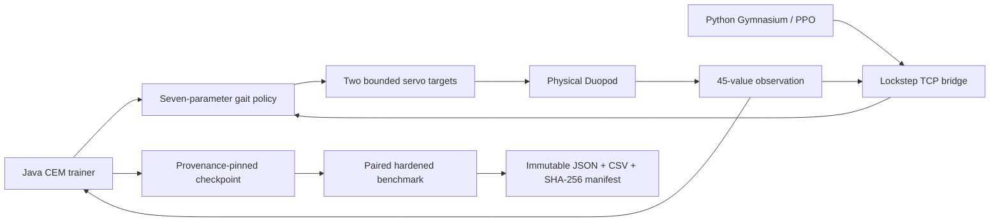

# Minecraft Machines

[](https://github.com/AhHamedi/MinecraftMachines/actions/workflows/ci.yml)
[](https://ahhamedi.github.io/MinecraftMachines/)
[](https://github.com/AhHamedi/MinecraftMachines/releases/latest)
[](LICENSE.md)

**An embodied-AI robotics lab inside Minecraft, built around experiments that can fail honestly.**

Minecraft Machines is a NeoForge 1.21.1 mod that combines a physically articulated robot, an in-process Java cross-entropy-method (CEM) trainer, a lockstep Python reinforcement-learning bridge, and machine-readable evaluation artifacts. Policies command bounded servo targets; they cannot teleport the robot or write its velocity directly.

[](https://github.com/AhHamedi/MinecraftMachines/releases/download/v0.1.0/duopod_test.mov)

The current machine is the **Duopod**: one central Sable rigid body and two servo-driven limbs assembled from Create components. The full-quality 13.5-second capture is included with the [v0.1.0 release](https://github.com/AhHamedi/MinecraftMachines/releases/tag/v0.1.0).

## Result at a glance

The promoted controller comes from a fresh, explicitly seeded 12-generation CEM run. Generation 5—not the run's highest-training-score checkpoint—passed the unchanged held-out gate twice.

| Publication evidence | Result |
|---|---:|
| Fixed-protocol benchmark repeats | `2 / 2 accepted` |
| Mandatory criteria | `8 / 8` in each repeat |
| Mean post-warmup forward displacement | `3.0775 blocks` |
| Forward displacement at speeds 0.50 / 0.80 / 1.10 | `3.6595 / 2.9411 / 2.6321` |
| Margin over stronger stability-adjusted baseline | `3.0775 blocks` |
| Machine failures / arena escapes | `0 / 0` |
| Minimum body-up | `0.6083` — gate `≥ 0.6000` |
| Peak vertical excursion | `2.1274 blocks` — gate `≤ 3.0000` |

This establishes repeatable straight-crawl behavior in world seed `-3368720904110701394` under one exact protocol. It does **not** establish multi-seed optimizer reliability, arbitrary-terrain locomotion, turning, navigation, or cross-version physics robustness.

- Explore the [interactive evidence dashboard](https://ahhamedi.github.io/MinecraftMachines/).
- Verify the [fresh-search evidence bundle](artifacts/duopod_walk_forward_v6/README.md).
- Read the [engineering case study](docs/engineering-case-study.md) and [acceptance audit](docs/duopod-training-acceptance-audit.md).

## Why the evidence is unusual

Earlier controllers sometimes moved farther while failing physically. The repository keeps those rejected artifacts instead of retroactively cleaning the story:

- a positive average hid backwards motion at one required speed;
- control-boundary sampling missed a mid-step fall, launch, and lane escape;
- a controller passed the benchmark twice, but an audit found that its training-lane topology provenance was false;
- the fresh run's highest training score failed the held-out posture threshold, so a lower-scoring stable checkpoint was promoted.

The final gate pairs learned, neutral, and scripted controllers over the same three lanes, episode IDs, and seeds. Posture, height, and containment are sampled on every physics tick. UUID-named JSON/CSV artifacts are bound by SHA-256 manifests written only after both files commit.



## Install the v0.1.0 preview

This is an experimental research release for **Minecraft 1.21.1** and **Java 21**. Install these compatible NeoForge mods before adding the Minecraft Machines JAR:

| Dependency | Required version |
|---|---:|
| NeoForge | `21.1.228` or newer compatible 21.1 build |
| Create | `6.0.10` or newer compatible build |
| Sable | `2.x` |
| Simulated | `1.3.0` or newer compatible build |
| Create Aeronautics | `1.3.0` or newer compatible build |

Download `minecraft_machines-neoforge-1.21.1-0.1.0.jar` from the [latest release](https://github.com/AhHamedi/MinecraftMachines/releases/latest), place it and its dependencies in the instance's `mods/` directory, and launch through NeoForge. The release includes SHA-256 checksums.

The recorded locomotion evidence predates Git history and correctly reports `code_revision: null`. A clean release rebuild from tag `v0.1.0` independently reproduced the preserved benchmark JAR's SHA-256, `e17f2a845fdbfed7736fd16a68625bc44720624413b527c25db5182171a77624`, establishing byte-for-byte equality. The runtime artifact itself still does not encode a Git revision; that limitation remains explicit.

## Build and verify

Clone with the pinned upstream physics source:

```bash
git clone --recursive https://github.com/AhHamedi/MinecraftMachines.git
cd MinecraftMachines
```

Run the deterministic release checks:

```bash
./gradlew :minecraft_machines:common:test :minecraft_machines:neoforge:compileJava
PYTHONPATH=training/python/src python3 -m unittest discover -s training/python/tests
python3 artifacts/duopod_walk_forward_v6/verify_evidence.py
python3 tools/verify_publication.py
```

Run the stateful NeoForge integration suite separately:

```bash
./gradlew :minecraft_machines:neoforge:runGameTest
```

Build the distributable JAR:

```bash
./gradlew :minecraft_machines:neoforge:build
```

The output is written under `minecraft_machines/neoforge/build/libs/`.

## Work with the experiment

The main command surface is `/mm` (alias `/minecraft_machines`). Start with the [AI project guide](AI_PROJECT_GUIDE.md) for command syntax, schemas, training semantics, and operational safeguards. The most relevant areas are:

- `minecraft_machines/common`: schemas, rewards, environment, CEM primitives, and unit tests;
- `minecraft_machines/neoforge`: physical spawners, commands, live training, bridge, benchmark, and GameTests;
- `training/python`: Gymnasium and Stable-Baselines3 tooling;
- `artifacts/duopod_walk_forward_v6`: promoted checkpoint, accepted repeats, diagnostics, and verifier;
- `portfolio`: static evidence dashboard and historical artifact catalog.

Do not resume a checkpoint when morphology, policy, schema hashes, curriculum, or fitness contract differ. Training reward, a replay, or attractive forward displacement alone is not locomotion acceptance evidence.

## Contributing and security

Contributions are welcome; read [CONTRIBUTING.md](CONTRIBUTING.md) before changing physics-sensitive behavior or evidence. Report security issues through the private process in [SECURITY.md](SECURITY.md).

Minecraft Machines is released under the [MIT License](LICENSE.md). The repository integrates [`Creators-of-Aeronautics/Simulated-Project`](https://github.com/Creators-of-Aeronautics/Simulated-Project) as a pinned Git submodule; that project retains its own license.
