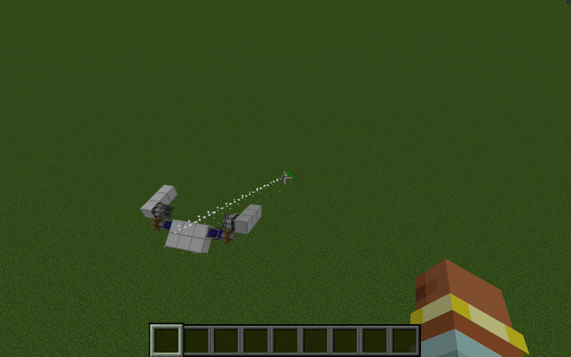

# Minecraft Machines

[](https://github.com/AhHamedi/MinecraftMachines/actions/workflows/ci.yml)
[](LICENSE.md)

Minecraft Machines is an experimental Minecraft 1.21.1 mod for building and controlling physically simulated machines. The current prototype focuses on a two-servo robot called the Duopod.



The project is under active development. APIs, commands, machine layouts, and training behavior may change without notice. There are no supported binary releases yet; build from source if you want to try it.

## What is included

- A bounded robotic servo joint with angle, speed, torque, and telemetry controls.
- A physical Duopod assembled with Create, Simulated, Create Aeronautics, and Sable.
- An in-process Java cross-entropy-method trainer.
- A loopback Python Gymnasium bridge with Stable-Baselines3 tooling.
- Deterministic unit tests, NeoForge GameTests, and a controlled walk-forward benchmark.

The demo shows one development run in a controlled test world. It is not a claim that the controller generalizes to arbitrary terrain, worlds, or Minecraft versions.

## Requirements

- Java 21
- Minecraft 1.21.1
- NeoForge 21.1.228
- [Create](https://github.com/Creators-of-Create/Create) 6.0.10
- [Sable](https://github.com/ryanhcode/sable) 2.x
- [Simulated and Create Aeronautics](https://github.com/Creators-of-Aeronautics/Simulated-Project) 1.3.0

The repository pins the Simulated/Create Aeronautics source tree as a Git
submodule. The other mods are resolved as external build/runtime dependencies.

## Build from source

```bash
git clone --recursive https://github.com/AhHamedi/MinecraftMachines.git
cd MinecraftMachines
./gradlew :minecraft_machines:neoforge:build
```

The development JAR is written to `minecraft_machines/neoforge/build/libs/`.

If the submodule was not cloned, initialize it with:

```bash
git submodule update --init --recursive
```

## Run the development client

```bash
./gradlew :minecraft_machines:neoforge:runClient
```

Commands are registered under `/mm` with `/minecraft_machines` as an alias. Useful entry points include:

```text
/mm spawn_servo_test
/mm spawn_worm
/mm train status
/mm train duopod cem status
/mm train bridge status
```

The complete command tree lives in `MinecraftMachinesCommands.java` and is exposed through Minecraft's command suggestions.

## Test

Run the Java and Python suites:

```bash
./gradlew :minecraft_machines:common:test :minecraft_machines:neoforge:compileJava
PYTHONPATH=training/python/src python3 -m unittest discover -s training/python/tests
```

Run the stateful NeoForge integration tests separately:

```bash
./gradlew :minecraft_machines:neoforge:runGameTest
```

## Repository layout

```text
minecraft_machines/common    Shared blocks, control, training, and tests
minecraft_machines/neoforge NeoForge integration, commands, spawners, and GameTests
training/python             Gymnasium client and training utilities
external/Simulated-Project  Pinned external physics source
```

See [training/python/README.md](training/python/README.md) for bridge setup, PPO training, evaluation, and live-test commands.

## Project ownership

Minecraft Machines is an independent, unofficial add-on. It is not affiliated
with or endorsed by Mojang, Microsoft, the Create team, the Simulated/Create
Aeronautics team, RyanHCode, or Ocelot.

Ahmed Hamed authors and maintains the Minecraft Machines code. This project
does **not** claim ownership of its dependencies:

- Simulated and Create Aeronautics are maintained by The Simulated Team / The
  Creators of Aeronautics. Their repository is present only as a pinned Git
  submodule and keeps its own code and asset licenses.
- Sable is created by RyanHCode and is used under its separate PolyForm Shield
  license. Sable Companion is a separate RyanHCode/Ocelot project.
- Create and the remaining platform libraries keep their respective licenses.

The Minecraft Machines JAR does not bundle those projects' classes or asset
trees; users install the required mods separately. Some Gradle build
configuration is derived from the Simulated Project under its MIT code
license. The complete attribution and license boundary is recorded in
[THIRD_PARTY_NOTICES.md](THIRD_PARTY_NOTICES.md), which is also included in
built JARs.

## Contributing

Contributions and bug reports are welcome. Read [CONTRIBUTING.md](CONTRIBUTING.md) before opening a pull request and use [SECURITY.md](SECURITY.md) for private vulnerability reports.

The original Minecraft Machines code is available under the [MIT
License](LICENSE.md). Third-party projects retain their own licenses; see
[THIRD_PARTY_NOTICES.md](THIRD_PARTY_NOTICES.md).
