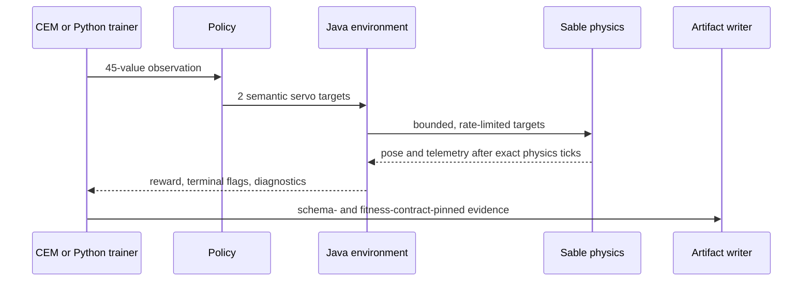

# Engineering Case Study: Turning a Minecraft Locomotion Demo into a Falsifiable Experiment

## Executive summary

Minecraft Machines had all the visible ingredients of an embodied-learning project: an articulated robot, servo actions, observations, rewards, and two training paths. It did not yet have evidence that could distinguish locomotion from passive settling, favorable terrain, a fall, or a ballistic launch.

The useful result of the repair is therefore not a cherry-picked animation. It is a causal experiment with immutable failures:

1. two v1 checkpoints were benchmarked and rejected;
2. those failures revealed that controllers and candidates were being compared at different arbitrary world sites;
3. training and evaluation were moved into the same temporary flat, paired arena;
4. a fresh v2 stage-one checkpoint was benchmarked twice;
5. both v2 runs produced exactly the same episode and acceptance metrics, proving the controlled protocol was repeatable;
6. the repeatable failure exposed a frame mismatch and an insufficient anti-ballistic gate;
7. fitness v3 moved motion into a post-warmup frame and produced a generation-6 checkpoint that looked 3/3 under control-boundary sampling;
8. hardened benchmark `eb0b3949-159a-4ad3-a7ae-92f991977b07` sampled every physics tick and rejected that checkpoint at speed `0.50` with a failure, lane escape, minimum body-up `-0.004774`, and `5.492683` blocks of peak vertical excursion;
9. the discrepancy exposed temporal aliasing plus a nearly contiguous training-floor versus three-lane benchmark topology mismatch;
10. fitness v5 then produced one exact genome that passed two hardened benchmarks, but an independent audit proved its selected candidate had not actually spawned on the grouped lane centers claimed by the checkpoint;
11. fitness v6 makes arena construction and morphology spawning share one grouped mapping, pins that mapping in checkpoint format v4, and refuses publication unless the complete canonical environment contract matches;
12. a fresh explicitly seeded v6 search evaluated population 32 with 8 elites for 12 generations; generation 5 passed two manifest-committed benchmarks, while the higher-training-aggregate generation 8 was rejected by the held-out posture gate.

The implemented final protocol is fitness `minecraft_machines:duopod_cem_fitness_v6`, arena `minecraft_machines:temporary_flat_duopod_lane_groups_v2`, slot layout `minecraft_machines:isolated_three_lane_groups_v1`, checkpoint format `minecraft_machines_duopod_cem_checkpoint_v4`, benchmark format `minecraft_machines_duopod_walk_forward_benchmark_v3`, and acceptance rule `post_warmup_stability_adjusted_anti_ballistic_v2`. Fresh run `7bf2b216-3414-4030-88a8-3e6316823358`, seed `2026080301`, promoted generation 5 with aggregate/mean/worst `30.296754 / 16.582846 / 14.855634`, success `1.0`, failure `0.0`, and genome `6762d9ede735d81b1d7e7dd19ba7d8714d979f9953d3b7c500200dc1a6f0195f`. Benchmark IDs `c647d862-f7e4-4d34-8b69-2fcd0591edaf` and `6b5506a5-e24b-4df2-b972-49cbe6ed1a51` passed 8/8 with learned mean/margin `3.077521`, zero learned failures, and zero learned escapes. Final verification passed with 93 common Java tests, 75 Python tests plus 7 environment-dependent skips, and 29/29 NeoForge GameTests.

The v5 run progressed from a healthy generation-1 signal—best aggregate `33.0632`, mean `19.4321`, worst `14.5244`, 3/3 gate success, zero failures—to selected generation-2 candidate 25, whose exact genome passed two benchmark repeats. Those passes remain valuable diagnostics. The current claim rests on a new v6 optimizer run with an explicit seed and truthful phase-gait distribution metadata, without resuming incompatible v5 optimizer state.

The final clean integration run also exposed an independent lifecycle defect: failed Duopod assembly rollback used a level-wide before/after sublevel diff, so unrelated live physics bodies could be mistaken for transaction-owned state. Rollback now records only the UUIDs returned by its own child/base assembly steps, including partial child assembly IDs, and removes only those UUIDs. Stateful Sable GameTests were split into explicit batches; the final CEM lifecycle test now completes with valid controls rather than passing amid cross-test machine invalidation.

## 1. System under test

The project is a NeoForge mod for Minecraft 1.21.1 built on Create Aeronautics, Create Simulated, and Sable. Its portfolio-facing morphology is the Duopod:

- one central Sable body;
- two constrained child bodies;
- one robotic servo joint per side;
- a cog, swivel bearing, hanging iron limb, and honey contact tip on each side.

The controller emits two normalized semantic servo targets. The servo layer maps them into bounded physical targets with `+/-60` degrees of travel, a `90` degrees/second rate limit, stiffness `800`, damping `350`, and maximum torque `75,000`. The right joint is reflected into the same semantic coordinate frame as the left, so positive has the same limb-relative meaning on both sides.

The current interface contract is observation schema `minecraft_machines:duopod_locomotion` v6 with 45 values and action schema `minecraft_machines:duopod_servo_targets` v3 with two values. Checkpoints carry both schema hashes, the policy type, curriculum, distribution, and fitness contract.



## 2. Forensic timeline

### Attempt 01: training fitness looked respectable, benchmark failed

The first preserved checkpoint used `duopod_phase_gait_v1`, population `16`, elite count `2`, three scenarios per candidate, and short `160`-tick episodes. Its generation-14 aggregate fitness was `2.5577` with no recorded training failures.

The fixed v1 benchmark rejected it. Learned mean forward displacement was only `+0.0711` blocks. Its raw mean margin over the stronger baseline was `+0.6783`, but the learned controller moved backwards at requested speed `0.80`, so the positive-at-every-speed criterion failed.

Evidence:

- [attempt 01 checkpoint](../portfolio/data/duopod_walk_forward_checkpoint_attempt_01.json)
- [attempt 01 failed JSON](../portfolio/data/walk_forward_benchmark_attempt_01_failed.json)
- [attempt 01 failed CSV](../portfolio/data/walk_forward_benchmark_attempt_01_failed.csv)

This was the first important result: aggregate fitness and an aggregate margin were not sufficient evidence of a useful gait.

### Attempt 02: longer episodes exposed instability, not locomotion

The second preserved checkpoint used `400`-tick episodes and reached generation 3. The learned controller averaged `-0.4011` blocks of forward displacement and reached a minimum body-up of `0.2394`. It failed the margin, positive-at-every-speed, and upright criteria.

The scripted controller produced a striking raw mean of `+10.3322` blocks, but all three scripted episodes were machine failures with large vertical and lateral excursions. This was not a strong locomotion baseline; it was evidence that raw displacement could reward a physics launch.

Evidence:

- [attempt 02 checkpoint](../portfolio/data/duopod_walk_forward_checkpoint_candidate_02.json)
- [attempt 02 failed JSON](../portfolio/data/walk_forward_benchmark_attempt_02_failed.json)
- [attempt 02 failed CSV](../portfolio/data/walk_forward_benchmark_attempt_02_failed.csv)

The longer CEM run also showed exploration collapse: the distribution standard deviation contracted while near-identical sampled genomes dominated the population. More generations on that distribution would search the same flawed neighborhood more precisely.

### Cross-attempt diagnosis: the world was a confounder

The two v1 benchmarks placed controllers at different arbitrary world sites. Even neutral behavior changed by roughly three blocks across the attempts, which was larger than the learned signal being interpreted. Candidates within training also saw different physical sites.

That made the comparison causally weak: a controller change and an environment change occurred together. No optimizer setting can repair that experimental design.

### Stage-one v2: a repeatable, controlled failure

The repaired v2 experiment used:

- policy `duopod_phase_gait_v2`;
- fitness contract `minecraft_machines:duopod_cem_fitness_v2`;
- population `32`, elite count `8`, and a fresh wide distribution;
- `800` episode ticks, `4` ticks per control interval, and three speed scenarios per candidate;
- common speed-indexed random seeds across candidates;
- one temporary smooth-stone arena with fixed lanes spaced 12 blocks apart;
- run-scoped chunk activation and transactional arena restoration.

The generation-one checkpoint had aggregate fitness `-4.3969`, mean score `-3.4347`, worst score `-3.8490`, and no failure recorded by its then-current training gate.

The paired benchmark rejected it twice with the same result:

| Metric | Run 01 | Run 02 |
|---|---:|---:|
| Learned mean forward displacement | `1.507332` | `1.507332` |
| Stability-adjusted scripted comparison mean | `2.619032` | `2.619032` |
| Margin over stronger adjusted baseline | `-1.111700` | `-1.111700` |
| Learned machine failures | `1` | `1` |
| Learned minimum body-up | `0.082457` | `0.082457` |
| Acceptance | Failed | Failed |

Every episode ID, seed, actual spawn origin, controller metric, and acceptance field is identical. Only `generated_at` differs between the two JSON files.

Evidence:

- [pre-final-gate v2 stage-one checkpoint](../portfolio/data/duopod_walk_forward_checkpoint_stage1_v2.json)
- [stage-one v2 failed run 01](../portfolio/data/walk_forward_benchmark_stage1_run_01_failed.json)
- [stage-one v2 failed run 02](../portfolio/data/walk_forward_benchmark_stage1_run_02_failed.json)

These are deliberately labeled **pre-final-gate diagnostic failures**. They demonstrate protocol repeatability, not accepted locomotion.

### Fitness v3 generation 6: apparent success failed under hardened sampling

The post-warmup fitness-v3 run reached generation 6 with aggregate fitness `43.246663`, zero recorded candidate failures, and apparent 3/3 gate success at the three training speeds. That result was promising, but its posture and arena extrema were sampled only at the four-tick control boundaries.

Hardened benchmark `eb0b3949-159a-4ad3-a7ae-92f991977b07` sampled the learned, neutral, and scripted controllers on every physics tick. It preserved positive learned displacement at every speed and reported both a learned mean and an adjusted stronger-baseline margin of `4.529146` blocks. It still rejected the checkpoint:

| Speed | Learned forward | Failure | Escape | Minimum body-up | Peak vertical | Result |
|---:|---:|---:|---:|---:|---:|---|
| `0.50` | `5.594749` | Yes | Yes | `-0.004774` | `5.492683` | Failed |
| `0.80` | `3.964264` | No | No | `0.667782` | `2.144356` | Passed |
| `1.10` | `4.028423` | No | No | `0.645385` | `2.149689` | Passed |

Evidence:

- [generation-6 fitness-v3 checkpoint](../portfolio/data/duopod_walk_forward_checkpoint_final_v3.json)
- [hardened failed JSON](../portfolio/data/walk_forward_benchmark_per_tick_candidate_01_failed.json)
- [hardened failed CSV](../portfolio/data/walk_forward_benchmark_per_tick_candidate_01_failed.csv)
- [immutable evidence manifest](../portfolio/data/walk_forward_benchmark_per_tick_candidate_01_failed_manifest.json)

This was a useful falsification. The motion was not dismissed because it looked dramatic; it was rejected because the complete trajectory violated four declared criteria.

### Fitness v5: accepted twice, then rejected on provenance

Fitness v5 aligned trainer and benchmark sampling cadence and changed the arena floor to isolated three-lane groups. Selected generation-2 candidate 25 recorded aggregate fitness `48.048369`, zero training failure rate, and genome SHA-256 `be80280e365ebb756e2f9041655f11377e94e68674c68ab2db6b701c9abf2d3e`; it passed the hardened benchmark twice:

| Run | Benchmark ID | Learned mean | Minimum body-up | Peak vertical | Failures / escapes | Benchmark gate |
|---|---|---:|---:|---:|---:|---|
| 01 | `239f85b4-4fee-418c-906f-0ef770d74407` | `4.145461` | `0.658708` | `2.167221` | `0 / 0` | Accepted |
| 02 | `4c6b374a-0505-4cb4-a724-fa03229ce5dc` | `4.071139` | `0.655156` | `2.167618` | `0 / 0` | Accepted |

Evidence:

- [fitness-v5 checkpoint](../portfolio/data/duopod_walk_forward_checkpoint_final_v5.json)
- [accepted diagnostic run 01](../portfolio/data/walk_forward_benchmark_v5_pre_fix_run_01_accepted.json) and [manifest](../portfolio/data/walk_forward_benchmark_v5_pre_fix_run_01_accepted_manifest.json)
- [accepted diagnostic run 02](../portfolio/data/walk_forward_benchmark_v5_pre_fix_run_02_accepted.json) and [manifest](../portfolio/data/walk_forward_benchmark_v5_pre_fix_run_02_accepted_manifest.json)

The acceptance values are genuine measurements of that genome in the benchmark. They are still non-promotable. The independent audit traced candidate 25 to local slots 3–5: the arena builder inserted the group gap before those prepared lanes, but the morphology spawner continued requesting contiguous offsets. The robots therefore did not train at the prepared centers represented by the arena provenance. A later benchmark pass cannot retroactively make that training comparison causal.

### Fitness v6: fresh seeded search and two accepted repeats

The final [checkpoint](../artifacts/duopod_walk_forward_v6/checkpoint/duopod_cem_fresh_v6_seed2026080301_accepted.json) records format v4, fitness v6, run `7bf2b216-3414-4030-88a8-3e6316823358`, seed `2026080301`, generation `5`, aggregate/mean/worst `30.296754 / 16.582846 / 14.855634`, success/failure `1.0 / 0.0`, and genome SHA-256 `6762d9ede735d81b1d7e7dd19ba7d8714d979f9953d3b7c500200dc1a6f0195f`. Its immutable `trainingConfig` records population 32, 8 elites, 12 generations, exactly three canonical lanes, spacing `12`, control cadence `4`, warmup `20`, horizon `200`, arena v2, and slot layout v1.

| Run | Benchmark ID | Learned mean / adjusted margin | Minimum body-up | Peak vertical | Failures / escapes | Result |
|---|---|---:|---:|---:|---:|---|
| [01](../artifacts/duopod_walk_forward_v6/benchmark_run_01/duopod_cem_walk_forward_benchmark_c647d862-f7e4-4d34-8b69-2fcd0591edaf.json) | `c647d862-f7e4-4d34-8b69-2fcd0591edaf` | `3.077521006266276` / `3.077521006266276` | `0.6082669526583021` | `2.127410888671875` | `0 / 0` | Accepted 8/8 |
| [02](../artifacts/duopod_walk_forward_v6/benchmark_run_02/duopod_cem_walk_forward_benchmark_6b5506a5-e24b-4df2-b972-49cbe6ed1a51.json) | `6b5506a5-e24b-4df2-b972-49cbe6ed1a51` | `3.077521006266276` / `3.077521006266276` | `0.6082669526583021` | `2.127410888671875` | `0 / 0` | Accepted 8/8 |

Run 01's [manifest](../artifacts/duopod_walk_forward_v6/benchmark_run_01/duopod_cem_walk_forward_benchmark_latest_manifest.json) commits JSON/CSV SHA-256 `4b5b2d4459ea8b81b15a863635a41b88080abffd879205379c9611643365d69e` / `15d1c0bcc9442ff47316ec0d916ae8c74677fec1958e4ebc1c7763097a3675d3`. Run 02's [manifest](../artifacts/duopod_walk_forward_v6/benchmark_run_02/duopod_cem_walk_forward_benchmark_latest_manifest.json) commits `71ffc0583cb90ea4bf10d2700e4e18d4e9ba0ab8614278e977d04491727e380f` / `5a8747d1e4f622c0c8444f290af7b2cd13c79372e38e45a745b3c51f0135dbac`. Both say `commit_complete: true`. Generation 8's higher aggregate `36.5139` was rejected because its held-out body-up minimum `0.59605` missed the fixed `0.60` gate.

The certification boundary is explicit: both runs used level `world`, seed `-3368720904110701394`, dimension `minecraft:overworld`, and the same fixed protocol. Both runtime artifacts also record `code_revision: null` with status `unavailable_in_runtime_artifact`, so the evidence is not bound to a Git commit.

## 3. What the failed attempts taught us

### Reward and acceptance must describe the same behavior

The original dense return emphasized command tracking. The publication benchmark cared about terminal displacement, minimum uprightness, and machine failure. Those are related signals, but they are not equivalent. A policy could rank well during training and still fail the criteria used after training.

The pre-final-gate v2 terminal fitness introduced a publication-aligned term for each speed episode:

- forward displacement is measured along a fixed horizontal frame;
- unstable positive displacement receives no positive forward credit;
- failure and upright shortfall are penalized directly;
- stable positive progress receives a success bonus;
- the weakest speed receives explicit worst-case weight.

The current `minecraft_machines:duopod_cem_fitness_v6` contract preserves that dense-plus-terminal design, moves displacement into the post-warmup frame, includes peak vertical excursion in stability and success, and accumulates the safety extrema every physics tick. Missing or non-finite body-up telemetry fails closed. This makes CEM selection use the same causal properties and temporal resolution as the acceptance gate.

### A failed baseline cannot be credited for a launch

The historical benchmark v2 artifacts use the versioned rule `stability_adjusted_failed_baselines_v1`. When a baseline fails, its positive forward displacement is capped at zero for the comparison mean. The raw displacement remains in the artifact; it is not deleted or rewritten. This keeps the evidence inspectable while preventing a launch from defining the locomotion target.

The current benchmark v3 rule is `post_warmup_stability_adjusted_anti_ballistic_v2` (rule version 2). It retains the failed-baseline adjustment and adds the shared post-warmup frame plus the hard vertical-excursion gate.

### The speed-conditioned policy needed a real speed signal

The v1 phase-gait decoder divided the requested speed by four when it entered the observation and then treated that encoded value as though it were the original command. The v2 policy corrects that scale, broadens the gain range, and rejects exact reuse of incompatible v1 checkpoints.

Fresh v2 search also includes deterministic structured gait probes, a `0.12` per-parameter standard-deviation floor, wider initialization, a restart floor for incompatible checkpoints, and hard exploration expansion when the population collapses.

### Common random numbers reduce candidate-ranking noise

Within a generation, every candidate now sees the same seed for a given requested speed. This does not make the physics universally deterministic. It removes one avoidable source of variance from the ranking comparison.

### The physical environment has to be paired too

The benchmark runs three sequential controller batches over the same three speed-indexed lanes. Each controller environment is destroyed before the next is created. Lane identity, requested origin, actual spawn origin, episode ID, and seed are stored and validated before output is written.

The temporary arena snapshots the bounded world region, lays smooth-stone support, rejects unsafe block-entity overlap, and restores the original blocks during cleanup. Before mutation it fsyncs and atomically promotes a compressed NBT restoration journal; unfinished journals replay across loaded dimensions at server start, and recovery errors retain the journal and fail new arenas closed. A chunk lease covers every lane for the complete run instead of relying on manual `/forceload` state. One P2 durability limitation remains: after an in-memory restore succeeds, the journal can be removed before affected chunks are explicitly forced to disk, so a power loss in that interval could lose the recovery record.

### Time and topology have to be paired too

The generation-6 failure showed that sharing terminal formulas was not enough. With `control_ticks=4`, observing only decision boundaries could alias away a fall, launch, or lane escape between actions. Fitness v5 introduced, and fitness v6 retains, benchmark-v3 sampling of minimum body-up, vertical excursion, and lane escape on every held-action physics tick with incomplete sample counts rejected.

Training originally laid 24 lanes on an almost-contiguous floor, while the benchmark constructed only three lanes. Arena `minecraft_machines:temporary_flat_duopod_lane_groups_v2` added one unused lane-width after every three lanes, but v5 changed only arena construction: the morphology spawner still used contiguous `slot * spacing` offsets. Candidate 25's local slots 3–5 therefore diverged exactly where the first group gap appeared.

Fitness v6 defines slot layout `minecraft_machines:isolated_three_lane_groups_v1` and makes both arena preparation and morphology spawning use the same grouped-offset function. Spawn comes from each lane's exact prepared center, and walk-forward publication permits exactly three scenarios per candidate. The claimed topology is now the topology actually evaluated during training.

### Publication eligibility is a protocol, not a filename

Checkpoint v4 preserves the original `trainingConfig` JSON snapshot instead of reconstructing provenance through current defaults. Before a benchmark can start, v6 requires the exact current fitness contract, arena ID, slot-layout ID, spacing, control cadence, warmup, horizon, three-scenario count, and compatible environment protocol. Checkpoint resume applies the same spacing/environment compatibility boundary, and loading is rejected while training, evaluation, benchmark, replay, or bridge work is active.

Checkpoint and evidence writers force temporary files before atomic promotion. Benchmark artifacts also force the containing directory after promotion. Together with immutable benchmark-ID files and the last-written manifest, this makes the byte-level evidence and its causal eligibility separate, explicit gates.

## 4. The post-warmup frame and per-tick sampling defects

The repeatable stage-one v2 run exposed a subtler mismatch.

All machines receive a 20-tick neutral assembly warmup before controller actions begin. Stage-one v2 reset minimum-body-up and vertical-excursion tracking after that warmup, but terminal forward displacement still came from `forward_displacement_from_spawn_blocks`: the pre-warmup spawn origin. Passive assembly settling could therefore enter the controller's fitness and the benchmark margin while stability metrics began later.

That mixed two time frames in one acceptance record.

The post-warmup repair does three things:

1. captures a horizontal position baseline after the complete warmup;
2. measures controller forward and lateral displacement from that same post-warmup baseline in training and benchmark evaluation;
3. measures peak vertical excursion from the post-warmup baseline and makes `3.0` blocks a hard training-success and benchmark-acceptance limit.

The vertical threshold comes from the controlled evidence. Neutral stage-one episodes peaked near `2.07` blocks, while the failed scripted ballistic episode at speed `0.50` peaked near `7.01` blocks. The threshold leaves room for normal assembly motion but rejects the observed launch regime.

Fitness v3 fixed that frame, and fitness v5 fixed the sampling cadence, but the provenance audit then exposed the independent grouped-placement defect. Fitness v6 completes the causal repair by unifying the prepared and spawned lane mapping and pinning it in checkpoint/publication compatibility. The two final v6 artifacts now promote the controller-performance numbers for their fixed world/protocol, and the post-repair verification suite passes.

## 5. Fixed acceptance protocol

The final benchmark evaluates three controllers:

1. learned phase-gait v2;
2. neutral zero action;
3. scripted alternating sine.

Each controller runs at requested forward speeds `0.50`, `0.80`, and `1.10` on the same speed-indexed lanes. The artifact records raw and stability-adjusted comparison values.

Both final artifacts declare benchmark format `minecraft_machines_duopod_walk_forward_benchmark_v3`, fitness contract `minecraft_machines:duopod_cem_fitness_v6`, arena `minecraft_machines:temporary_flat_duopod_lane_groups_v2`, slot layout `minecraft_machines:isolated_three_lane_groups_v1`, checkpoint format `minecraft_machines_duopod_cem_checkpoint_v4`, and acceptance rule `post_warmup_stability_adjusted_anti_ballistic_v2` (rule version 2). Each manifest names one benchmark ID and matches the forced immutable JSON/CSV pair. Both repeats identify the same eligible genome and training snapshot.

Acceptance requires all of the following:

1. canonical checkpoint-v4 fitness, arena, slot-layout, spacing, cadence, warmup, horizon, and three-scenario provenance;
2. exact controller/speed coverage with complete per-tick samples;
3. finite and bounded metrics;
4. exact paired prepared-center lane provenance;
5. learned mean forward displacement at least `0.50` blocks above the stronger stability-adjusted baseline;
6. positive learned displacement at every speed;
7. zero learned machine failures;
8. learned minimum body-up of at least `0.60`;
9. learned peak vertical excursion no greater than `3.0` blocks;
10. zero learned arena escapes;
11. two forced immutable bundles with matching genome/training provenance and valid manifest hashes.

| Final evidence | Run 01 | Run 02 |
|---|---:|---:|
| Benchmark ID | `c647d862-f7e4-4d34-8b69-2fcd0591edaf` | `6b5506a5-e24b-4df2-b972-49cbe6ed1a51` |
| Accepted | Yes, 8/8 | Yes, 8/8 |
| Learned mean / adjusted margin | `3.077521006266276` / `3.077521006266276` | `3.077521006266276` / `3.077521006266276` |
| Learned per-speed forward | `3.659454`, `2.941055`, `2.632053` | `3.659454`, `2.941055`, `2.632053` |
| Failures / escapes | `0 / 0` | `0 / 0` |
| Minimum body-up | `0.6082669526583021` | `0.6082669526583021` |
| Peak vertical excursion | `2.127410888671875` | `2.127410888671875` |
| Manifest JSON / CSV SHA-256 | `4b5b2d4459ea8b81b15a863635a41b88080abffd879205379c9611643365d69e` / `15d1c0bcc9442ff47316ec0d916ae8c74677fec1958e4ebc1c7763097a3675d3` | `71ffc0583cb90ea4bf10d2700e4e18d4e9ba0ab8614278e977d04491727e380f` / `5a8747d1e4f622c0c8444f290af7b2cd13c79372e38e45a745b3c51f0135dbac` |

## 6. Reproduction commands

Verify deterministic and integration layers:

```bash
./gradlew :minecraft_machines:common:test :minecraft_machines:neoforge:check
./gradlew :minecraft_machines:neoforge:runGameTest
PYTHONPATH=training/python/src python3 -m unittest discover -s training/python/tests -v
```

Start the declared fresh experiment from the server console:

```mcfunction
/mm train duopod cem start_fresh_at 31 80 63 north 32 12 800 4 3 12 max_slots 24 walk_forward seed 2026080301
```

The positional arguments are population `32`, maximum generations `12`, episode ticks `800`, control ticks `4`, scenarios per candidate `3`, spacing `12`, and maximum active slots `24`.

Run the paired benchmark:

```mcfunction
/mm train duopod cem benchmark_walk_forward_at 31 80 63 north 200
```

The arena is temporary. After any interrupted live run, clean owned state with:

```mcfunction
/mm train duopod cem stop
/mm train clear
/mm train bridge stop
```

## 7. Verification evidence

| Layer | Current result | What it establishes |
|---|---:|---|
| Java common unit tests | `93/93` passed | Reward, scenario, schema, CEM, terminal-fitness, and acceptance logic |
| Python unit tests | `75` passed, `7` environment-dependent skips | Bridge protocol, terminal identity, evaluation parsing, and manifest checks |
| NeoForge compile/check | Passed | Integrated Java source and checks |
| GameTests under the final v6 contract | `29/29` passed | Shared mapping, truthful seeded checkpoint provenance, publication guards, arena recovery, and integration |
| Controlled diagnostic benchmark | Two identical failed v2 results | The paired environment is repeatable |
| Hardened v3 generation-6 benchmark | Rejected | Temporal and topology confounds remained measurable |
| Fitness-v5 benchmark repeats | Accepted twice, provenance-invalid | Genuine behavior; not eligible for promotion |
| Final paired fitness-v6 benchmark repeats | Accepted twice; 8/8 each; manifests hash-verified | Fixed-world/fixed-protocol locomotion acceptance |

Unit tests are not substitutes for Sable integration, and GameTests are not substitutes for the live learned-vs-baseline benchmark.

## 8. Honest limitations

- The portfolio controller is a seven-parameter structured CEM gait, not a PPO success.
- The paired benchmark is one deterministic episode per controller/speed cell. Two repeats are an acceptance gate, not a robustness distribution.
- Both accepted repeats use level `world`, seed `-3368720904110701394`, dimension `minecraft:overworld`, and one fixed protocol; they do not establish arbitrary-terrain or multi-seed generalization.
- The v6 checkpoint comes from one fresh seeded search; it does not establish optimizer reliability. Generation-one structured probes make the initialization informed rather than purely random. Future work should publish distributions across declared training seeds.
- Upstream physics changes can alter behavior even when observation and action schemas remain compatible.
- Both runtime artifacts report `code_revision: null`, so the runtime evidence is not Git-commit-bound.
- Arena recovery has a narrow P2 power-loss window after in-memory restore and before affected chunks are forced to disk.

## 9. Portfolio claim boundary

The honest portfolio statement is:

> I rebuilt an embodied-learning experiment so controllers are paired in space, topology, seeds, and sampling cadence; rejected a twice-passing v5 result when its training provenance failed audit; and ran a fresh seeded 12-generation v6 search. I also rejected its highest-training-score checkpoint at the unchanged held-out posture gate, then promoted generation 5 only after two manifest-verified repeats passed all eight locomotion and safety criteria at `3.0775` mean forward blocks with zero failures or escapes. This is fixed-world, fixed-protocol evidence, not a claim of multi-seed or arbitrary-terrain generalization.

For current operational status, see the [training status report](duopod-training-status-report.md). For the promotion checklist, see the [acceptance audit](duopod-training-acceptance-audit.md). The June-era report remains available only as a [superseded historical record](duopod-training-implementation-report.md).
